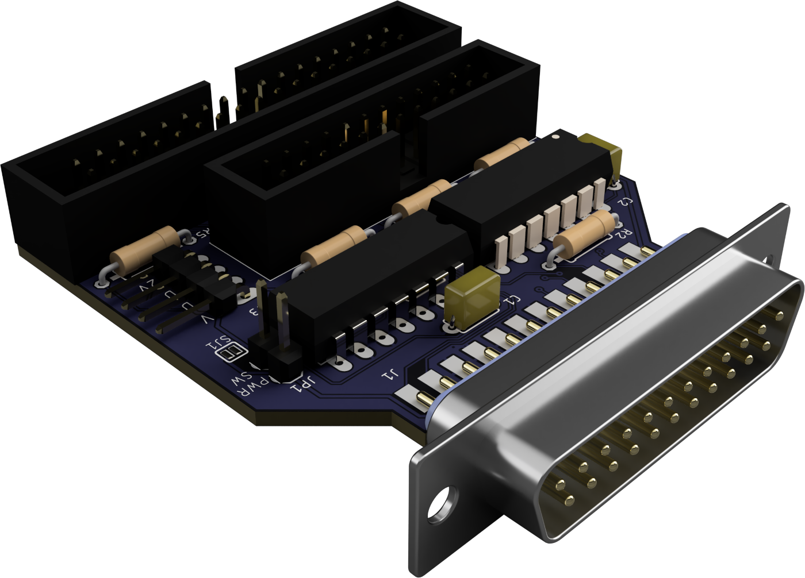
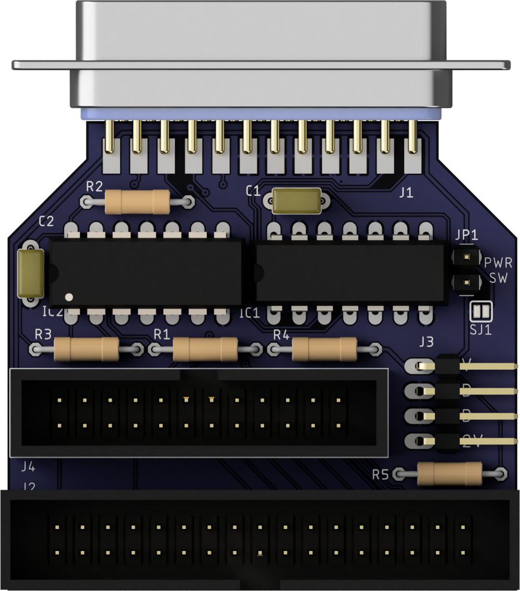

# Retro Ninja Amiga external floppy adapter
An adapter that allows external connection of Shugart floppy disk drives or Gotek floppy emulators

This adapter has been tested with various Amiga floppy drives and Gotek floppy emulators.
It was designed to plug directly into the external floppy port of the Amiga and connect a Gotek USB emulator with a 34-pin IDC cable and a power cable. The floppy connector on the board is rotated so a floppy cable can go in a straight loop to a Gotek laying on top of the Amiga.
It should also be possible to mount the adapter in an external case but the floppy cable would have to be turned 180 degrees to match the connectors of the board and a Gotek.

J1 is the male 23 pin D-sub connector that plugs into the external drive port on the amiga. Pretty hard to find these today but it looks like new ones will be manufactured soon.

J2 is a male header for connecting the floppy cable. Connector can be straight or right angle, open or walled depending on what you got and what you want.

J3 is for floppy power connector. Cables can be soldered directly to board if needed.

J4 is the passthrough connector for a second or third external drive.  
Connect first row of pins on header (1...23) to first row of pins on female D-sub (1...12).  
Connect second row of pins on header (2...22) to the second row of pins on female D-sub (13...23).  

This design was based on information gathered from Amiga System Programmer's Guide by Abacus and from the scematics for the A1020 drive.  
Designed using Fusion 360. Gerber files and Eagle schematics included.

This is the third version of the board. The only new functionality from earlier versions is the added power switch/jumper. Other changes are that IC1 has been changed from 74LS00 to 74LS38, the power connector has been rotated to allow a right angle connector and silkscreen has been updated.

## BOM
 |Component|Pcs |Name|Comment|
 |:--------|---:|:---|:------|
 | 74LS38 Quad NAND | 1 | IC1 | 74F38 works and 74LS03/74HCT03 seems to work too. 74LS26 and variants of it might work. 74LS00 works partially |
 | 74LS74 Flip-Flop | 1 | IC2 | 74HCT74 works fine | 
 | 100nF ceramic capacitor | 2 | C1, C2 ||
 | 1k resistor | 4 | R1, R2, R3, R4 ||
 | 12k resistor | 1 | R5 ||
 | D-sub 23M connector | 1 | J1 | D-sub This connector is pretty hard to source at the moment. Try eBay |
 | 34-pin male header | 1 | J2 | 2x17 pin 2.54mm pitch. For floppy cable IDC connector |
 | 4 pin header | 1 | J3 | 2.54mm pitch. For floppy power cable connector (or solder cables directly to board) |
 | 24-pin header | 1 | J4 | 2x12 pin 2.54mm pitch header for outgoing connection to next drive in chain. For example IDC to DB23F. D-sub 23F connectors were manufactured by Unicorns and can't be found today |
 | Jumper | 1 | JP1 | Optional jumper or connection for a power switch. If you don't need a power jumper/switch - just leave it and bridge the solder jumper SJ1 instead |
